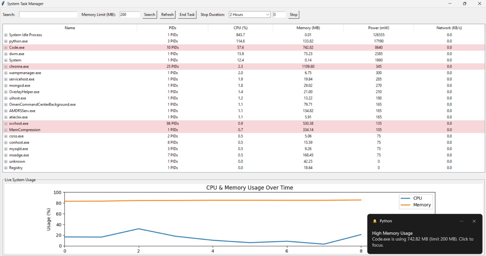

# 🖥️ System Task Manager

A Windows desktop Task Manager application built with **Python + Tkinter** that gives you real-time visibility into running processes — with the ability to search, kill, suspend, and monitor memory & CPU usage — all in a clean GUI with **live graphs** and **desktop toast notifications**.

---

## 📸 Output Screenshot



> The screenshot above shows the app running live — process list, live CPU & Memory graph, and a real desktop notification popping up for `Code.exe` exceeding the 200 MB memory limit.

---

## ✨ Features

### 🔍 Search & Filter
- Type any process name in the **Search** box and hit **Search** to instantly filter the process list
- Clears back to full list when search is empty

### 📋 Process Table (Grouped View)
- All `.exe` processes are **grouped by filename** — so if `chrome.exe` has 25 individual PIDs, they appear as one row
- Each row shows:
  - **Name** — process name
  - **PIDs** — how many instances are running (e.g., `25 PIDs`)
  - **CPU (%)** — total CPU usage across all instances
  - **Memory (MB)** — total RAM used
  - **Power (mW)** — estimated power draw
  - **Network (KB/s)** — real-time network usage
- Rows **highlighted in pink/red** = processes exceeding the memory limit
- Click the **➕ expand button** on any row to see individual PID-level details

### 🔔 Memory Limit & Toast Notifications
- Set a **Memory Limit (MB)** in the top bar (default: 200 MB)
- When any process group **exceeds the limit**, a **Windows desktop notification** pops up (bottom-right corner)
- The notification shows: `"Code.exe is using 742.82 MB (limit 200 MB). Click to focus."`
- **Clicking the toast** brings the app to the front and highlights the offending process

### ❌ End Task
- Select any process row and click **End Task**
- **Terminates all PIDs** in that group at once

### ⏸️ STOP / Suspend Process
- Select a process and choose a **Stop Duration**:
  | Option | Duration |
  |--------|----------|
  | 2 Hours | 2 hours |
  | 7 Days | 7 days |
  | 1 Month | ~30 days |
  | 1 Year | 365 days |
  | Custom (Minutes) | Enter any number of minutes |
- Click **Stop** → all PIDs in the group are **suspended (frozen)**
- After the duration ends, they **automatically resume** — no manual action needed
- Suspended state is **saved to disk** (`suspended_state.json`) — so even if you close and reopen the app, it remembers which processes were stopped and resumes them correctly

### 🔄 Auto Refresh
- The process list **auto-refreshes every 30 seconds**
- Click **Refresh** button anytime for an immediate manual update

### 📊 Live CPU & Memory Graph
- Bottom panel shows a **real-time line chart** — "CPU & Memory Usage Over Time"
- **Blue line** = CPU usage (%)
- **Orange line** = Memory usage (%)
- Updates live as you use the app — gives a visual trend over time

---

## 🛠️ Tech Stack

| Library | Used For |
|---------|----------|
| `tkinter` + `ttk` | Main GUI window, table, buttons, dropdowns |
| `psutil` | Reading live process data (CPU, memory, network, PIDs) |
| `matplotlib` | Drawing the live CPU & Memory graph |
| `win10toast_click` | Windows 10/11 desktop toast notifications |
| `threading` | Background refresh loop + suspend timers |
| `json` | Saving/loading suspended process state to disk |

---

## ⚙️ How to Run

### Requirements
- **Windows 10 or 11** (toast notifications are Windows-only)
- **Python 3.10+**

### Steps

```bash
# Step 1: Go into the project folder
cd taskmanager

# Step 2: Activate the virtual environment
.venv\Scripts\activate

# Step 3: Run the app
python stop.py
```

> ✅ All packages are already installed in `.venv` — no need to run `pip install`

---

## 📁 Project Structure

```
taskmanager/
│
├── stop.py              ← MAIN FILE — run this to launch the app
├── n3.py                ← Extended version with more features
├── n2.py                ← Intermediate build
├── graph.py             ← CPU/Memory graph component
├── notification.py      ← Toast notification logic
├── task.py              ← Core process utilities
├── refresh.py           ← Auto-refresh logic
├── searchbar.py         ← Search bar component
├── first.py             ← Early prototype
├── new.py               ← Experimental code
├── test.py              ← Unit tests
├── test2.py             ← Additional tests
├── screenshot.png       ← Output screenshot (for README)
├── suspended_state.json ← Auto-created when you suspend a process
└── .venv/               ← Virtual environment (all dependencies included)
```

---

## 👤 Author

| Field | Details |
|-------|---------|
| **Roll No** | 4GW24CI004 |
| **Project** | System Task Manager |
| **Language** | Python |
| **Platform** | Windows |

